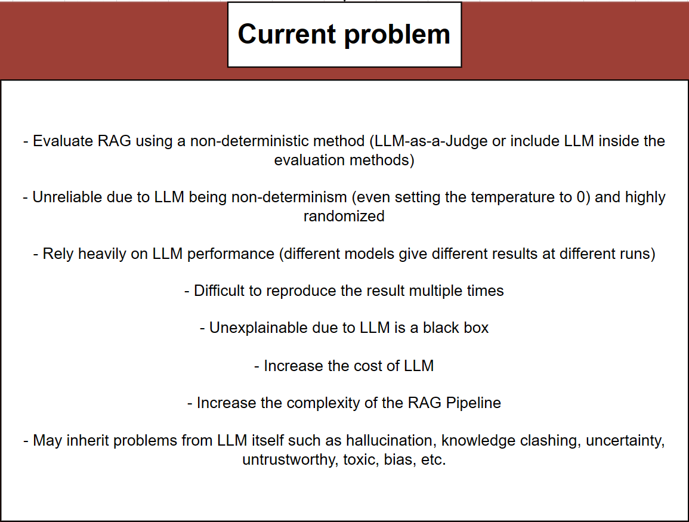
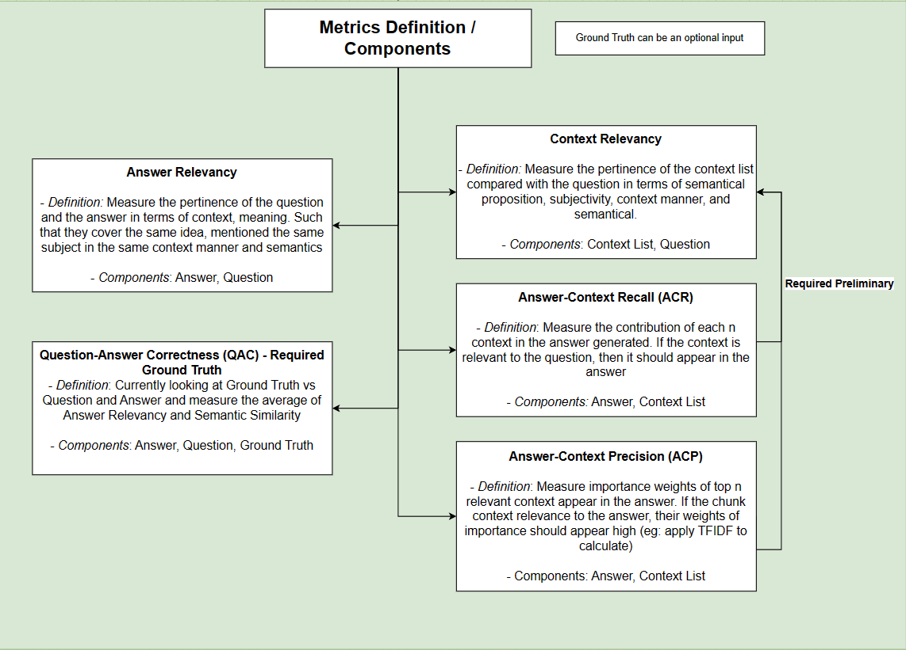
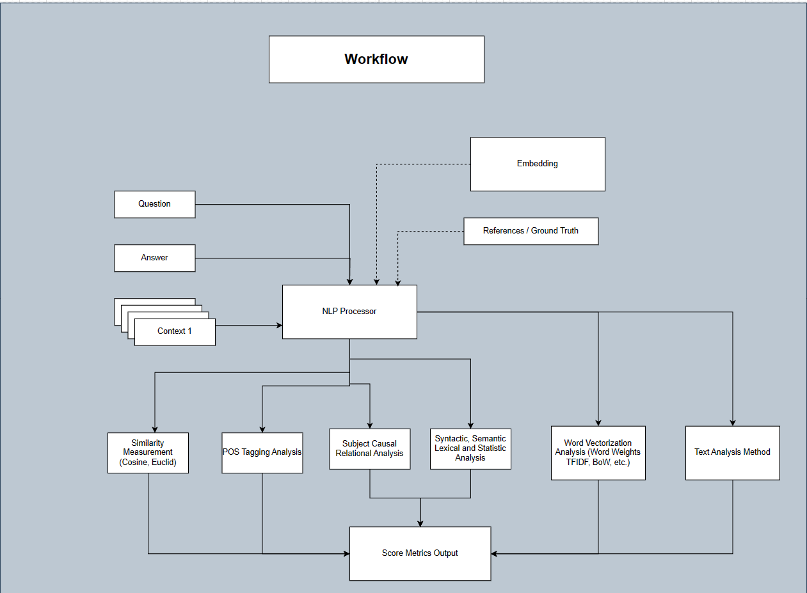

# detereval
> Evaluate your RAG more determine 📝 with __detereval__

Deterministic Evaluation aka __detereval__ is a framework aims to provide an interface where you can evaluate your Retrieval Augmented Generation (RAG) more determine by using pure NLP methodology. We might also looking forward to expand into CV and Multi-Modal aspect as well.

## Why __detereval__ ?

We understand that evaluate your RAG might be painful and difficult.  Current existing methods provide with more non-deterministic method by using LLM-as-a-Judge under the hood, making the process of evaluating a RAG more complex, low reproducibility with high bias and LLM-reliance.

> 🤫 Chance that if you are using GPT-3.5-Turbo to evaluate your RAG, your result might be _"a bit"_ differences compare to the result from better the model like GPT-4-Turbo or Llama-3-70b - which required heavy machine 😥

At __detereval__, we want to provide you with a more robust and determine method helps you to analyse your RAG more effectively, increase the transparency and explainability in your RAG pipeline.
This way you improve your RAG performance by adjusting the correct components that required improvement.

## Metrics Category

__detereval__ aims to bring the foundation work but with different approach. The idea of this work built upon previous foundation that has been layout by other method framework like RAGAS, RGB, TruLens. But we aim for more determine methods.

## Preliminary Workflow Design

This is the workflow design for __detereval__

## Installation

__TBA__

## Quickstart

__TBA__
